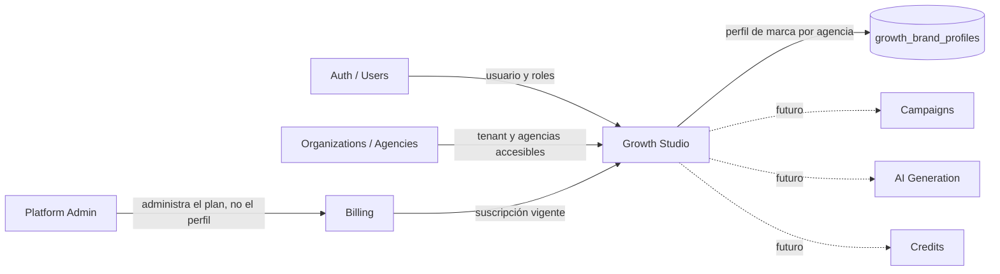

# Growth Studio — Diseño técnico de la primera entrega

**Fecha:** 2026-07-16
**Estado:** Aprobado e implementado
**Alcance:** Fases 1 y 2 — acceso, navegación y perfil de marca por agencia
**Rama:** `codex/growth-studio-phase-1`

---

## Resumen ejecutivo

La primera entrega incorpora **Growth Studio** como una sección nueva del sidebar de Vibook, ubicada inmediatamente después de **CRM Ventas**. Temporalmente estará disponible para todos los roles y planes de organizaciones con suscripción vigente.

El módulo tendrá dos entradas:

- `Inicio`: selección obligatoria de agencia y resumen del estado del perfil.
- `Mi marca`: alta y edición del perfil de marca de la agencia seleccionada.

El perfil pertenece a una agencia, no a un usuario ni a toda la organización. Solo puede existir un perfil activo por agencia. Todos los roles podrán leerlo y editarlo, pero únicamente dentro del alcance de agencias que ya poseen en Vibook. La habilitación general no amplía el acceso de un usuario a agencias que hoy no puede consultar.

Esta entrega no incluye campañas, generación con OpenAI, créditos, biblioteca de contenidos, publicaciones ni administración específica del feature desde Platform Admin.

---

## Decisiones confirmadas

| Tema | Decisión |
|---|---|
| Nombre visible | `Growth Studio` |
| Ruta base | `/growth-studio` |
| Ubicación | Sección nueva después de `CRM Ventas` |
| Submenú inicial | `Inicio` y `Mi marca` |
| Entitlement temporal | Cualquier plan con suscripción vigente |
| Roles | Todos los roles del tenant pueden leer y editar |
| Dueño del perfil | Agencia |
| Selección de agencia | Obligatoria |
| URL directa sin entitlement | Página de acceso denegado |
| Administración específica en Platform Admin | Diferida |
| Campañas, IA y créditos | Fuera de esta entrega |
| Metodología | Spec-first, DDD donde aporte, Context Mapping, YAGNI y outside-in/TDD |
| Supabase | El repo está vinculado a producción `Vibook Services - 2026` (`pmqvplyyxiobkllapgjp`) |

### Regla exacta de acceso de la primera entrega

La organización puede usar Growth Studio cuando se cumple esta condición:

1. La suscripción permite entrar a Vibook según `isAccessAllowed()`.

`organizations.plan` y `custom_plan_id` no participan temporalmente en la decisión. STARTER, PRO, ENTERPRISE, CUSTOM y organizaciones legacy sin plan reciben el mismo resultado si la suscripción está vigente.

Esta apertura es una decisión de rollout, no un permiso configurable por el tenant. Cuando se defina el packaging comercial definitivo, deberá introducirse un entitlement explícito y testeado en lugar de volver a dispersar comparaciones de planes.

---

## Objetivos

1. Dar acceso seguro y coherente a Growth Studio desde el sidebar y por URL directa.
2. Permitir que cualquier rol de una organización activa configure el perfil de marca de una agencia accesible.
3. Mantener el contexto de agencia durante la navegación y evitar escrituras ambiguas.
4. Preparar un contrato de perfil que las fases futuras puedan consumir para generar contenido.
5. Introducir el mínimo cambio posible en billing, permisos y base de datos.

## No objetivos

- Crear campañas o briefings.
- Generar texto o imágenes.
- Integrar OpenAI u otro proveedor.
- Implementar créditos, consumos o límites.
- Publicar en redes sociales.
- Crear biblioteca de assets o contenidos.
- Agregar un panel específico de Growth Studio en Platform Admin.
- Permitir que tenant admins habiliten o deshabiliten el producto.
- Agregar permisos configurables por rol para Growth Studio.
- Resolver versionado histórico o aprobación editorial del perfil.

---

## Principios de diseño y desarrollo

### Entender antes de codificar

La implementación comienza con esta especificación, criterios de aceptación y tests de comportamiento. No se diseña desde componentes aislados ni desde la tabla.

### DDD estratégico

Growth Studio es un bounded context nuevo. Es consumidor de identidad, tenancy, agencias y billing; no es dueño de esos conceptos.

### DDD táctico

Se modela solamente el agregado estable de esta entrega:

- Aggregate root: `BrandProfile`.
- Identidad de negocio: una combinación única `(org_id, agency_id)`.
- Invariantes: agencia accesible, agencia perteneciente al tenant, perfil válido y un único perfil por agencia.
- Comandos: crear o reemplazar el borrador completo del perfil.
- Consultas: obtener el perfil actual y su completitud.

No se crean repositorios genéricos, event bus, CQRS, domain events ni múltiples capas de adapters porque todavía no existe una necesidad comprobada.

### YAGNI y abstracción útil

- Se abstrae el acceso en un resolver compartido porque será usado por layout, páginas y API.
- Se abstraen validación, normalización y cálculo de completitud porque son reglas de dominio testeables.
- No se agrega `growth_studio` a `Module`, `agency_role_permissions` ni la matriz de settings: todos los roles tienen acceso por decisión de negocio y no hay configuración por rol en esta fase.
- No se crea un feature flag tenant-editable.
- No se introduce una dependencia de Spec Kit en el runtime. Se adopta su enfoque spec-first mediante los artefactos existentes del repo: spec, plan, criterios verificables y tareas pequeñas.

### Outside-in/TDD

Cada corte vertical empieza por el comportamiento observable:

1. Test de acceso o flujo que falla.
2. Contrato mínimo de dominio/API.
3. Implementación mínima para hacerlo pasar.
4. Refactor con tests verdes.
5. Siguiente comportamiento.

---

## Context Mapping



| Contexto | Responsabilidad | Relación con Growth Studio |
|---|---|---|
| `auth` | Usuario autenticado y roles efectivos | Upstream; Growth Studio no modifica usuarios |
| `organizations/agencies` | Tenant y asignación de agencias | Upstream; define las agencias seleccionables |
| `billing` | Estado de suscripción | Upstream; define si la organización está habilitada |
| `platform-admin` | Administración global de organizaciones y planes | Controla acceso indirectamente mediante billing |
| `permissions` | Permisos operativos configurables por agencia | No participa en esta entrega porque todos los roles pueden editar |
| `growth-studio` | Perfil de marca por agencia | Dueño del agregado `BrandProfile` |
| `campaigns`, `ai-generation`, `credits` | Capacidades futuras | Consumidores futuros del perfil; no se implementan ahora |

### Contrato entre contextos

Growth Studio recibe únicamente:

- `user.id`, `user.org_id`, `user.role` y `user.roles` desde auth.
- `organization.plan` y datos de suscripción desde billing.
- IDs y nombres de agencias permitidas desde el scope actual de permisos/agencias.

No duplica reglas de billing ni decide qué agencias puede ver cada rol. Reutiliza los helpers existentes y filtra de nuevo por `org_id` en cada query user-facing.

---

## Arquitectura

```text
AppSidebar / páginas server de Growth Studio
  -> resolveGrowthStudioAccess()
  -> servicio de aplicación lib/growth-studio/
  -> Supabase request-scoped client
  -> growth_brand_profiles + RLS + constraints
```

### Responsabilidades por capa

| Capa | Responsabilidad |
|---|---|
| UI | Selección de agencia, formulario, estados visuales y feedback |
| Server page/layout | Auth, entitlement, carga inicial y acceso denegado |
| API route | Auth, parsing Zod, códigos HTTP y mapeo de errores |
| `lib/growth-studio` | Reglas, scope de agencia, normalización, completitud y persistencia |
| PostgreSQL | Unicidad, integridad tenant-agencia, timestamps, RLS e índices |

### Estructura propuesta

```text
app/(dashboard)/growth-studio/
  layout.tsx
  page.tsx
  brand/page.tsx
  access-denied.tsx
app/api/growth-studio/brand-profile/route.ts
components/growth-studio/
  agency-context-selector.tsx
  growth-studio-home.tsx
  brand-profile-form.tsx
  profile-completeness.tsx
lib/growth-studio/
  access.ts
  brand-profile.ts
  brand-profile-schema.ts
  brand-profile-service.ts
  __tests__/
supabase/migrations/20260716000001_growth_studio_brand_profiles.sql
```

Los nombres finales pueden ajustarse durante la implementación si el patrón local exige una ubicación más cercana, sin cambiar el contrato de capas.

---

## Navegación y experiencia

### Sidebar

Nueva sección después de `CRM Ventas`:

```text
Growth Studio
  Inicio      /growth-studio
  Mi marca    /growth-studio/brand
```

La visibilidad se calcula en servidor y se pasa a `AppSidebar` como un booleano explícito, por ejemplo `growthStudioEnabled`. No se consulta billing desde el componente cliente y no se ocultan solamente botones: las páginas y la API aplican el mismo resolver.

### Selección obligatoria de agencia

- La agencia se representa en la URL con `?agencyId=<uuid>`.
- Con una única agencia accesible se selecciona automáticamente.
- Con más de una, el usuario debe elegir antes de ver o editar el perfil.
- Al navegar entre `Inicio` y `Mi marca`, el link conserva `agencyId`.
- Un `agencyId` inválido, de otra organización o fuera del scope del usuario se trata como recurso no encontrado (`404`) para no filtrar existencia.
- Un usuario sin agencias accesibles ve un estado vacío accionable; no una página de acceso denegado.

La URL es la fuente de verdad para evitar estado global oculto y conservar el contexto tras refresh o link compartido.

### Estados requeridos

1. Loading inicial.
2. Organización con suscripción inactiva: acceso denegado con CTA hacia suscripción.
3. Usuario sin agencias accesibles.
4. Varias agencias pendientes de selección.
5. Agencia sin perfil: onboarding corto y CTA `Configurar mi marca`.
6. Perfil parcial: porcentaje y campos pendientes.
7. Perfil completo.
8. Guardado en progreso.
9. Guardado exitoso sin requerir F5.
10. Error recuperable conservando el formulario.

### Diseño visual

- Usar componentes de `components/ui` y tokens semánticos existentes.
- Mantener dark mode y responsive.
- Layout operacional compacto, no una landing de marketing.
- Formulario dividido en secciones cortas y escaneables.
- No agregar texto explicativo redundante.
- Icono sugerido: `Megaphone` de Lucide, consistente con el dominio y sin asset nuevo.

---

## Modelo de dominio del perfil

### Campos de la versión 1

`brand_name` es columna propia y obligatoria. El resto vive en un documento JSONB versionado porque se carga y guarda como un agregado completo, no se consulta por campos individuales y todavía va a evolucionar con campañas e IA.

```ts
type BrandProfileDataV1 = {
  identity: {
    tagline: string
    valueProposition: string
    differentiators: string[]
  }
  audience: {
    summary: string
    segments: string[]
  }
  voice: {
    tone: string
    personality: string[]
    wordsToUse: string[]
    forbiddenTerms: string[]
    writingRules: string
  }
  offer: {
    commercialFocus: string[]
    preferredDestinations: string[]
  }
  visual: {
    primaryColor: string | null
    secondaryColor: string | null
    styleNotes: string
  }
  conversion: {
    preferredCta: string
  }
  locale: {
    language: string
    country: string
  }
}
```

### Validación

- `brand_name`: 2–120 caracteres.
- Textos largos: límites explícitos para evitar payloads y prompts futuros descontrolados.
- Listas: trim, deduplicación case-insensitive, máximo por campo.
- Colores: `#RRGGBB` o `null`.
- Idioma inicial por defecto: `es`.
- País inicial por defecto: `AR`.
- Para crear el perfil se exige `brand_name`; el resto puede completarse de forma progresiva.
- La completitud es una función pura del dominio, no un porcentaje almacenado.

### Logo

La carga y administración de logo queda fuera de esta entrega para no incorporar todavía un bucket, policies de Storage y manejo de archivos. Las fases futuras podrán reutilizar el logo de configuración de agencia o agregar un asset de Growth Studio con un diseño explícito.

---

## Modelo de datos

Tabla nueva `growth_brand_profiles`:

| Columna | Tipo | Regla |
|---|---|---|
| `id` | UUID | PK, `gen_random_uuid()` |
| `org_id` | UUID | NOT NULL, FK `organizations(id)` |
| `agency_id` | UUID | NOT NULL, FK `agencies(id)` |
| `brand_name` | TEXT | NOT NULL, longitud validada |
| `profile_data` | JSONB | NOT NULL, default del documento v1 |
| `schema_version` | SMALLINT | NOT NULL, default `1` |
| `created_by` | UUID | FK nullable `users(id)`, se conserva en updates |
| `updated_by` | UUID | FK nullable `users(id)`, cambia en cada guardado |
| `created_at` | TIMESTAMPTZ | NOT NULL, default `now()` |
| `updated_at` | TIMESTAMPTZ | NOT NULL, default `now()` |

### Constraints e índices

- `UNIQUE (org_id, agency_id)` garantiza un perfil por agencia.
- Índice `(org_id, agency_id)` queda cubierto por la unique.
- Índice `updated_at DESC` solo se agrega si aparece una consulta real que lo use.
- Trigger de `updated_at` con nombre específico del contexto.
- `ON DELETE SET NULL` en auditoría evita que un perfil bloquee la baja de un usuario.
- Trigger o constraint trigger valida que `agencies.id = agency_id` tenga el mismo `org_id`; una FK simple no alcanza para impedir pares tenant-agencia inconsistentes.
- Checks mínimos para `brand_name` y `schema_version`.

La migración solo crea objetos nuevos. No altera filas ni constraints de tablas existentes.

### RLS

1. `ENABLE ROW LEVEL SECURITY` y `FORCE ROW LEVEL SECURITY`.
2. Policy tenant-scoped con `org_id IN (SELECT public.user_org_ids())`.
3. La aplicación agrega la defensa principal: toda lectura o escritura exige `user.org_id`, `.eq("org_id", user.org_id)` y agencia dentro de `getUserAgencyIds()`.
4. No se usa `createAdminClient()` en rutas user-facing.

El aislamiento RLS es por organización, consistente con el patrón actual. El sub-scope de agencia se aplica en la capa de aplicación para respetar roles primarios, roles adicionales y reglas existentes sin duplicarlas en SQL.

---

## Contratos HTTP

### `GET /api/growth-studio/brand-profile?agencyId=<uuid>`

**200 con perfil:**

```json
{
  "data": {
    "agency": { "id": "uuid", "name": "Agencia" },
    "profile": {
      "brandName": "Nombre",
      "data": {},
      "schemaVersion": 1,
      "completion": { "percentage": 55, "missing": ["voice.tone"] },
      "updatedAt": "2026-07-16T00:00:00Z"
    }
  }
}
```

Si todavía no existe perfil, `profile` es `null`; no se responde `404`.

### `PUT /api/growth-studio/brand-profile`

```json
{
  "agencyId": "uuid",
  "brandName": "Nombre",
  "data": {}
}
```

Semántica: upsert idempotente sobre `(org_id, agency_id)`. `created_by` se conserva; `updated_by` y `updated_at` se actualizan.

### Códigos

| Código | Caso |
|---|---|
| `200` | Lectura o guardado correcto |
| `400` | Payload inválido o usuario sin organización |
| `403` | Suscripción/plan sin entitlement |
| `404` | Agencia inexistente o fuera del scope |
| `500` | Falla no esperada, sin filtrar detalle interno |

---

## Seguridad e invariantes

- Nunca aceptar `org_id` desde el browser.
- Resolver `org_id` exclusivamente desde `getCurrentUser()`.
- Verificar entitlement en páginas y API.
- Verificar `agencyId` contra los IDs accesibles del usuario y contra `agencies.org_id`.
- Filtrar explícitamente `growth_brand_profiles` por `org_id` y `agency_id`.
- No usar service role.
- No registrar el contenido completo del perfil en logs.
- El upsert usa la clave tenant-agencia y nunca un ID suministrado por el cliente.
- Una organización no obtiene acceso si su suscripción está bloqueada.
- Un cambio de plan no oculta ni elimina el perfil mientras dure la habilitación general.

---

## Estrategia de pruebas

### Acceso

- STARTER/PRO/ENTERPRISE/CUSTOM/legacy + suscripción vigente → permitido.
- Cualquier plan con suscripción bloqueada → denegado.
- Usuario sin `org_id` → error controlado.
- Todos los roles conocidos → permitidos si el tenant está activo.

### Scope de agencias

- Rol con una agencia solo puede leer/escribir esa agencia.
- Rol org-wide conserva el alcance provisto por `getUserAgencyIds()`.
- Agencia de otro tenant → `404` y cero queries de perfil exitosas.
- Agency ID no asignado → `404`.

### Dominio

- Normaliza listas y espacios.
- Rechaza límites y colores inválidos.
- Calcula completitud de manera determinista.
- Preserva `created_by` y actualiza `updated_by`.

### API

- GET sin perfil devuelve `200` con `profile: null`.
- PUT crea.
- Segundo PUT actualiza la misma fila.
- Payload no válido devuelve `400`.
- Suscripción inactiva devuelve `403`.
- Scope inválido devuelve `404`.
- Todas las queries contienen `org_id` y `agency_id`.

### UI/E2E

- Sidebar visible para cualquier plan con suscripción vigente.
- URL directa sin acceso muestra acceso denegado.
- Con una agencia se conserva el contexto al navegar.
- Con varias, el formulario no aparece hasta seleccionar.
- Guardar actualiza la UI sin F5.
- Loading, empty, error, disabled y responsive verificados.

---

## Despliegue y seguridad de producción

El proyecto Supabase vinculado actualmente es producción:

- Nombre: `Vibook Services - 2026`
- Ref: `pmqvplyyxiobkllapgjp`
- `vibook-staging` (`rmhoqgrngpclupbitmnl`) existe, pero no está vinculado al repo.

Por decisión del usuario, la migración se aplicará directamente a producción cuando la implementación esté aprobada y validada. Antes de ejecutar `supabase db push` se exige:

1. Revisar `supabase migration list --linked`.
2. Ejecutar el dry-run soportado por la CLI y revisar el SQL exacto.
3. Confirmar que la migración solo crea `growth_brand_profiles`, sus objetos asociados y policies.
4. Ejecutar tests focalizados, aislamiento, lint y build.
5. Hacer un smoke autenticado local contra el entorno configurado sin escribir datos ajenos.
6. Obtener aprobación explícita para aplicar la migración productiva.
7. Aplicar, regenerar tipos y verificar policies/constraints con queries de solo lectura.

### Rollback

Como la tabla es nueva y no tiene consumidores previos:

1. Revertir el deploy de aplicación si hubiera un problema de UI/API.
2. Mantener la tabla para no perder perfiles creados mientras se corrige.
3. Solo si no existen filas o hay aprobación explícita, eliminar policies, trigger y tabla.

No se automatiza un `DROP TABLE` destructivo.

---

## Criterios de aceptación

- [ ] Una organización con suscripción vigente ve Growth Studio después de CRM Ventas, sin importar el plan.
- [ ] Una organización con suscripción inactiva no lo ve y obtiene acceso denegado por URL directa.
- [ ] Todos los roles del tenant activo pueden abrir y editar.
- [ ] Ningún rol accede a una agencia fuera de su scope actual.
- [ ] La selección de agencia es inequívoca y permanece en la URL.
- [ ] Existe un único perfil por agencia.
- [ ] Crear y editar no requiere refresh.
- [ ] No se usa service role ni se modifica la matriz dinámica de permisos.
- [ ] La migración no altera datos ni tablas funcionales existentes.
- [ ] RLS, filtros explícitos de tenant y tests de aislamiento están presentes.
- [ ] Campañas, IA, créditos, assets y administración específica quedan fuera.

---

## Riesgos y mitigaciones

| Riesgo | Mitigación |
|---|---|
| Sidebar visible pero API abierta/cerrada de forma distinta | Resolver compartido usado en layout, páginas y API |
| Fuga entre tenants | `org_id` desde sesión, filtros explícitos, RLS, FK y tests |
| Fuga entre agencias del mismo tenant | Validar `agencyId` con scope actual antes de consultar el perfil |
| Downgrade elimina contenido | El entitlement bloquea acceso, no borra filas |
| JSONB sin forma controlada | Zod versionado y `schema_version` |
| Migración directa a producción | Tabla nueva, dry-run, revisión SQL, checks y aprobación previa |
| Overengineering | Un aggregate, un servicio, una route y dos pantallas; sin IA ni infraestructura futura |

---

## Decisión pendiente de aprobación

La aprobación de esta spec confirma también:

1. El conjunto de campos `BrandProfileDataV1` propuesto.
2. Auto-seleccionar cuando el usuario tiene exactamente una agencia accesible.
3. Excluir custom plans salvo que una fase posterior agregue un entitlement explícito.
4. No incluir carga de logo en esta entrega.
