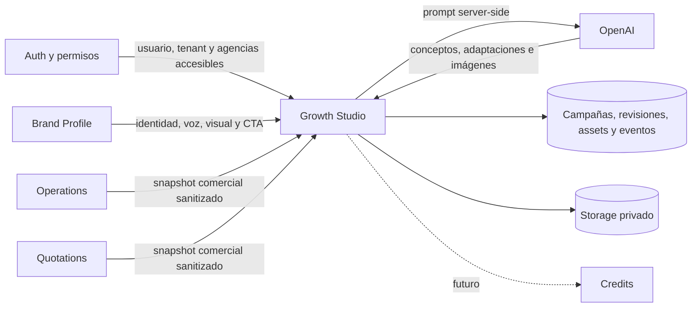

# Growth Studio — Fase 3: campañas, biblioteca y piezas

**Fecha:** 2026-07-16  
**Estado:** Implementado; migración remota pendiente  
**Alcance:** Campañas asistidas por IA, biblioteca privada de imágenes y compositor simple  
**Rama:** `codex/growth-studio-phase-1`

## Resultado de producto

Una persona selecciona obligatoriamente una agencia, completa un brief manual o parte de una operación/cotización, recibe tres conceptos de campaña, elige uno y lo adapta a Instagram Feed, Instagram Stories, WhatsApp y Email. Las imágenes se generan solamente para el concepto elegido y también pueden partir de una biblioteca privada de la agencia.

Las piezas exportadas usan exclusivamente la marca de la agencia. Vibook no agrega logo, firma, watermark ni texto promocional propio.

## Decisiones confirmadas

| Tema | Decisión |
|---|---|
| Variantes | Tres conceptos de campaña por generación |
| Flujo | Generar conceptos, elegir uno, adaptar canales y recién entonces generar imágenes |
| Canales | Instagram Feed, Instagram Stories, WhatsApp y Email |
| Stories | Pieza única o secuencia configurable de 3, 4 o 5 pantallas |
| Entregables Feed | Caption, CTA, hashtags y dirección visual |
| Entregables Stories | Texto por pantalla, CTA y dirección visual |
| Entregable WhatsApp | Mensaje listo para copiar |
| Entregables Email | Asunto, preheader, cuerpo y CTA |
| Perfil incompleto | Advierte, pero no bloquea |
| Fuentes | Brief manual, operación o cotización de la misma agencia |
| Privacidad de fuente | Solo campos comerciales; nunca clientes, pasajeros, contactos o documentos |
| Precio | Se incluye únicamente por opt-in y conserva moneda/vigencia |
| Aprobación | Sin workflow; todos los roles habilitados pueden generar y editar |
| Historial | Prompts, resultados, modelos, versiones y eventos internos |
| Métricas iniciales | Generado, seleccionado, editado, copiado, exportado y valorado |
| Aprendizaje | Las métricas ordenan recomendaciones; no reescriben la voz de marca automáticamente |
| Biblioteca | Privada por agencia; contiene uploads, generaciones y composiciones guardadas |
| Compositor | Fondo + título + texto secundario + CTA + logo movible |
| Logo | Logo exacto de la agencia; fallback inicial al logo de la organización |
| Complejidad del editor | Mover elementos, tamaño, color y alineación; sin capas libres, rotación ni editor tipo Canva |
| Calidad de imagen | Baja, media o alta; media por defecto |
| Límites | 20 generaciones de texto y 12 imágenes por agencia cada 24 horas; una imagen concurrente |
| Publicación | No publica ni envía; copia texto y descarga PNG |
| Créditos | Diferidos; el límite técnico deja un seam para incorporarlos después |

## Fases de implementación

### Fase 3A — Campaña y texto

1. Brief y selector de fuente comercial.
2. Reserva atómica del cupo de texto.
3. Tres conceptos estructurados.
4. Selección de un concepto.
5. Adaptación del concepto seleccionado a los canales elegidos.
6. Historial completo de inputs, prompt versionado, modelo, resultado y uso.

Esta fase entrega valor sin depender de imágenes y permite validar calidad de copy con costo bajo.

### Fase 3B — Biblioteca privada

1. Bucket privado tenant-scoped.
2. Upload de PNG, JPEG y WebP.
3. Listado por agencia con URLs firmadas de corta duración.
4. Assets generados y composiciones guardadas dentro de la misma biblioteca.
5. Archivado lógico, sin borrar historial de campañas.

### Fase 3C — Generación visual

1. Generación bajo demanda para Feed o cada pantalla de Stories.
2. Calidad elegida por el usuario.
3. Una única generación de imagen en curso por agencia.
4. Resultado guardado automáticamente en la biblioteca.
5. La IA genera el fondo sin logos ni marcas; el logo exacto se superpone en el compositor.

### Fase 3D — Compositor y exportación

1. Selección de un fondo de la biblioteca.
2. Título, texto secundario y CTA editables.
3. Elementos movibles dentro de límites normalizados.
4. Logo movible con tres tamaños y ajuste a esquinas.
5. Color, alineación y contraste básicos.
6. Exportación PNG sin branding de Vibook.
7. Guardado opcional de la composición como un nuevo asset.

## Context Mapping



- `auth`, `organizations`, `agencies` y `permissions` son upstream; Growth Studio no redefine su scope.
- `operations` y `quotations` publican un anticorruption layer comercial. Growth Studio nunca consume sus rows completas.
- `brand-profile` es un agregado del mismo bounded context y aporta un snapshot, no una dependencia mutable durante una generación.
- OpenAI es un proveedor externo detrás de un puerto pequeño y server-only.
- `credits` queda fuera. El contrato de reserva de uso podrá delegar a créditos sin modificar la UI de campañas.

## DDD estratégico y táctico

Growth Studio continúa como bounded context propio. Los agregados mínimos son:

- `Campaign`: brief, fuente, estado y concepto seleccionado.
- `BrandProfile`: perfil vigente por agencia, ya implementado.
- `Asset`: imagen privada utilizable como fondo, logo o composición.

`CampaignRevision` y `GenerationRequest` son registros de historial, no agregados públicos. Las revisiones son append-only. Una generación conserva el snapshot exacto usado aunque el perfil o la operación cambien después.

No se introducen repositorios genéricos, event bus, CQRS, colas ni un sistema de templates. Las abstracciones se limitan a reglas estables: proveedor de IA, sanitizador de fuentes, reserva de cuota y persistencia tenant-scoped.

## Modelo de datos

### `growth_campaigns`

- Identidad y scope: `id`, `org_id`, `agency_id`.
- Estado: `DRAFT`, `CONCEPTS_READY`, `CONCEPT_SELECTED`, `CHANNELS_READY`.
- `brief_data` JSONB validado con Zod.
- `source_type`: `manual`, `operation`, `quotation`.
- `source_id` opcional y `source_snapshot` sanitizado.
- `selected_concept_index` entre 1 y 3.
- Auditoría: creador, timestamps.

### `growth_generation_requests`

- Reserva y auditoría de cada llamada a IA.
- `kind`: `concepts`, `channels`, `image`.
- `status`: `pending`, `completed`, `failed`.
- `prompt_version`, `model`, `quality`, snapshots de input/output y uso.
- `idempotency_key` única por organización y agencia.
- Los límites cuentan requests `completed` de las últimas 24 horas y `pending` de hasta 15 minutos.
- La reserva y la finalización son RPCs autenticadas; no hay `INSERT` o `UPDATE` directo para requests.

### `growth_campaign_revisions`

- Historial append-only del contenido utilizable.
- `kind`: `concepts`, `channels`, `composition`.
- `version` incremental por campaña y tipo.
- `payload` JSONB validado en la aplicación.
- Referencia opcional a la generación que originó la revisión.

### `growth_assets`

- Scope por organización y agencia.
- `source`: `upload`, `generated`, `composition`, `logo`.
- `storage_path`, MIME, dimensiones, nombre y metadata.
- Referencias opcionales a campaña y generación.
- `archived_at` para ocultar sin destruir historia.

### `growth_studio_events`

- Eventos append-only para métricas internas.
- Tipos iniciales: `generated`, `selected`, `edited`, `copied`, `exported`, `rated`.
- Payload pequeño sin PII.
- No dispara cambios automáticos de prompts o perfil.

## Seguridad y privacidad

- Todas las rutas exigen `getCurrentUser()`, `user.org_id`, entitlement y agencia accesible.
- Toda query agrega `org_id` y `agency_id`; RLS es defensa adicional.
- RLS y Storage replican el alcance de agencia, incluidos roles con scope global dentro del tenant.
- Ninguna ruta user-facing usa service role.
- El bucket es privado. El browser recibe URLs firmadas, no paths de otros tenants.
- El nombre del objeto comienza con `org_id/agency_id/` y las policies validan el tenant.
- El logo de organización solo es fallback visual; no convierte el perfil en org-scoped.
- Los adaptadores de operación/cotización tienen allowlist de campos. No se serializan rows completas.
- OpenAI recibe `store: false` cuando la API lo soporta.
- Los errores no guardan ni registran prompts completos en logs.
- Las imágenes generadas se solicitan sin logo, watermark ni marca Vibook.

## Contratos de IA

- Texto: Responses API con Structured Outputs y schemas Zod.
- Modelo por defecto: `gpt-5.6-terra`, configurable por entorno.
- Imagen: Image API con `gpt-image-2`, configurable por entorno.
- Calidad: `low`, `medium`, `high`.
- Feed: cuadrado; Stories: vertical.
- Los prompts tienen versión explícita. Cambiar el texto del prompt exige actualizar esa versión y tests de contrato.
- Un provider interface permite testear sin red y cambiar modelos sin filtrar detalles a UI.

## Flujo de UI

```text
Campañas
  -> Nueva campaña
  -> Brief y fuente
  -> Generar 3 conceptos
  -> Elegir concepto
  -> Adaptar canales
  -> Generar o elegir imágenes
  -> Editar pieza
  -> Copiar / descargar / guardar en biblioteca

Biblioteca
  -> Subir o elegir imagen
  -> Agregar texto y logo
  -> Descargar o guardar composición
```

La interfaz reutiliza los componentes y tokens de Vibook. Es una herramienta operacional compacta, no una landing ni una demo de IA. Loading, vacío, límite alcanzado, error, guardado y reintento son estados explícitos.

## Outside-in/TDD

Orden de implementación:

1. Schemas puros de brief y outputs.
2. Sanitizadores que prueban ausencia de PII.
3. Reserva atómica e idempotencia.
4. Servicio de campaña y revisiones con scope tenant/agencia.
5. Routes HTTP.
6. UI del flujo textual.
7. Biblioteca y upload.
8. Provider de imagen y cupo.
9. Compositor/exportación.
10. Browser smoke autenticado.

Cada corte comienza con el test observable más cercano y termina con tests verdes antes del siguiente.

## No objetivos

- Publicar en Instagram.
- Enviar WhatsApp o Email automáticamente.
- Sincronizar métricas externas.
- Aprobar contenido por rol.
- Editor libre de capas, rotación, filtros, máscaras o tipografías cargadas por usuarios.
- Templates complejos.
- Créditos, cobros o packaging Enterprise.
- Reentrenar o modificar automáticamente el perfil de marca.

## Compuerta de migración

La migración de Fase 3 se prepara y valida localmente. No se aplica a Supabase hasta ejecutar tests focalizados, aislamiento, lint/build, revisar el dry-run y obtener confirmación explícita inmediata para el proyecto productivo `pmqvplyyxiobkllapgjp`.
